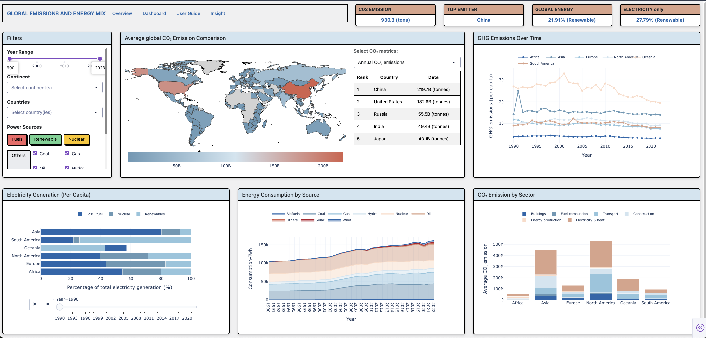

# Global Emissions & Energy Mix Dashboard

**An interactive, data-driven web application exploring CO₂ and GHG emissions across 190+ countries from 1990 to 2023.** 

Built with Python · Plotly Dash · Responsive Design

### Overview
`Climate change is one of the most pressing challenges of our time — yet the data behind it can feel overwhelming or inaccessible. This dashboard was built to change that`

Global Emissions & Energy Mix makes 30+ years of emissions and energy data explorable for anyone, regardless of their technical or scientific background. Whether you're a student, a policy enthusiast, or someone who simply cares about the planet, this tool is designed to help you see the story the data is telling.

Key questions this dashboard helps answer:

- Which countries are the biggest emitters — and is that changing?
- How much of our energy actually comes from clean sources?
- Why is decarbonising electricity alone not enough to reach net zero?
- Which sectors contribute the most CO₂, and where is the biggest opportunity for change?

### Dashboard Preview



> The dashboard is fully responsive — accessible on desktop, tablet, and mobile. Scan the QR code at a presentation to open it instantly on your phone.
### Teck stack

| Layer | Technology |
|---|---|
| **Framework** | [Plotly Dash](https://dash.plotly.com/) |
| **Visualisation** | [Plotly](https://plotly.com/python/) |
| **Data Processing** | Pandas, NumPy |
| **Styling** | Dash Bootstrap Components, custom CSS |
| **Language** | Python 3 |


### Project Structure

```
global-emissions-dashboard/
│
├── app.py                  # Main Dash application entry point
├── layout.py               # Dashboard layout and component structure
├── callbacks.py            # Interactivity logic (Dash callbacks)
├── data/
│   └── emissions_data.csv  # Cleaned dataset (1990–2023)
├── assets/
│   ├── styles.css          # Custom styling
│   └── dashboard_preview.png
├── requirements.txt
└── README.md
```

### Data Source Reference:
This dashboard draws on publicly available global emissions datasets:

- [Our World in Data – CO₂ and GHG Emissions](https://ourworldindata.org/co2-and-greenhouse-gas-emissions)
- [IEA – World Energy Statistics](https://www.iea.org/data-and-statistics)
- [Global Carbon Project – Global Carbon Budget](https://www.globalcarbonproject.org/)


Data covers 190+ countries across the period 1990–2023, including annual CO₂ emissions, GHG per capita, electricity generation by source, and CO₂ by sector.

### Dashboard Philosophy
This purpose was comprehensively built with one goal of mind: **_making CLIMATE DATA feel human_** The data is here, the story alreade put it on, WHAT WE DO NEXT IS UP TO US 

> Numbers like "37.4 billion tonnes of CO₂" are hard to grasp in isolation. By letting users filter by country, year, continent, and power source — and watching every chart respond in real time — the data becomes a conversation rather than a report.
The animated electricity timeline, cross-linked map, and sector breakdown are all designed to invite exploration, not just consumption.

_"Whether decarbonising electricity toward low-carbon sources is the only way toward a net-zero carbon footprint — this dashboard is built to help you find your own answer."_

## Author
Quynh Huong (Sylvie) Nguyen

Macquarie University

📧 quynhhuong.nguyen@students.mq.edu.au

## License
This project is open for educational and non-commercial use. Please credit the author and original data sources if you adapt or share this work.
> Further information could be found on **"GlobalEmission_PitchDeck.pptx"**
<div align="center">
Built with 💙 for climate awareness · Data-driven · Human-centred
</div>

