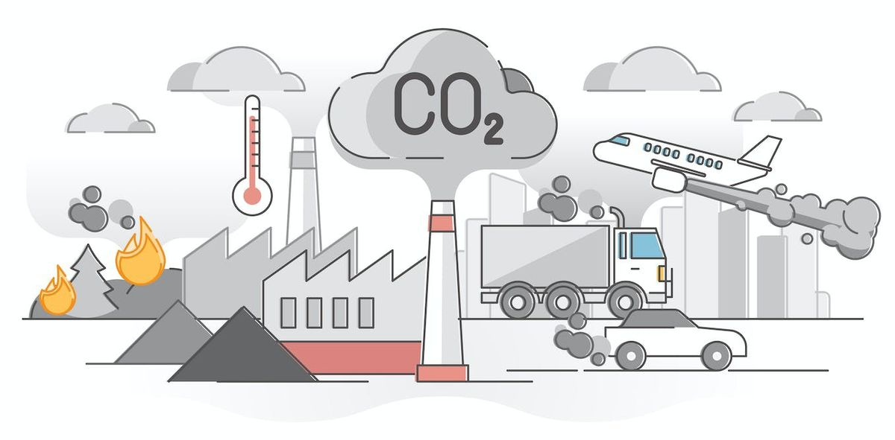
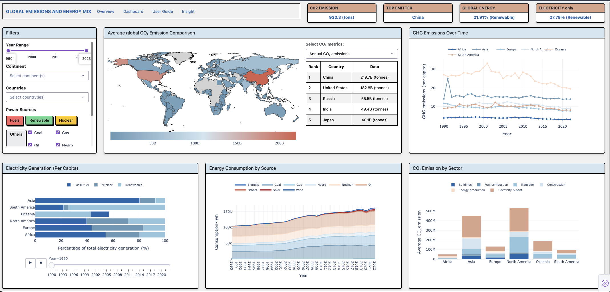

# Global Emissions & Energy Mix Dashboard

**Is the world actually decarbonizing or just decarbonizing the easiest 20% of the problem?**

### Overview

Global Emissions & Energy Mix makes 30+ years of emissions and energy data explorable for anyone, regardless of their technical or scientific background. Whether you're a student, a policy enthusiast, or someone who simply cares about the planet, this tool is designed to help you see the story the data is telling.

### Dashboard Philosophy

`Climate change is one of the most pressing challenges of our time, yet the data behind it can feel overwhelming or inaccessible. This dashboard was built to change that`

The aim was comprehensively built with one goal of mind: **_making CLIMATE DATA feel human_** The data is here, the story already put it on, WHAT WE DO NEXT, IS UP TO US !

> Numbers like "37.4 billion tonnes of CO₂" are hard to grasp in isolation. By letting users filter by country, year, continent, and power source and watching every chart respond in real time -> the data becomes a conversation rather than a report.
The animated electricity timeline, cross-linked map, and sector breakdown are all designed to invite exploration, not just consumption.

_"Whether decarbonising electricity toward low-carbon sources is the only way toward a net-zero carbon footprint, this dashboard is built to help you find your own answer."_

A couple of questions this dashboard can help you to answer:

- Which countries are the biggest emitters and is that changing?
- How much of our energy actually comes from clean sources?
- Why is decarbonising electricity alone not enough to reach net zero?
- Which sectors contribute the most CO₂, and where is the biggest opportunity for change?

### What I did

- Built an interactive dashboard tracking CO₂/GHG emissions and energy mix across 190+ countries, 1990–2023 (Our World in Data, IEA, Global Carbon Project)
- Compared G7 nations' decarbonization pathways to isolate what actually drives lower per-capita emissions
- Quantified the gap between "clean electricity" progress and real total-energy decarbonization
- Deployed the dashboard publicly (Docker + Google Cloud Run) so non-technical audiences, policy, general public, can explore it directly, not just view a static report

### Project Structure

### Key findings & recommendations

**1. Electricity decarbonization is outpacing total energy decarbonization, and the gap explains why net-zero is stalling.**

Nuclear and renewables made up ~32% of global *electricity* generation (2015–2023), but only ~22% of *total energy consumption*. The gap is transport and heating, which remain fossil-fuel dependent.

→ **Recommendation:** Climate strategy and investment focused on the power grid alone will plateau. The next decarbonization wave has to target transport and heating electrification specifically, not just cleaner electricity.

**2. Two countries account for a disproportionate share of cumulative emissions.**

China (~220B tonnes) and the US (~183B tonnes) together account for over 40% of cumulative global CO₂ emissions, 1990–2023 where European countries such as Germany, France, Italy and the UK record much lower total emissions.

→ **Recommendation:** Uniform, country-agnostic net-zero targets underweight where the leverage actually is. Any credible global framework needs bilateral accountability mechanisms specifically for these two economies, not just aggregate international targets.

**3. Energy mix, not development level, predicts decarbonization success.**

Among similarly developed G7 nations, outcomes diverge sharply by generation mix: France's high nuclear share keeps per-capita CO₂ low, while the US (65–70% fossil electricity) and Australia (~80% fossil) lag despite comparable GDP.

→ **Recommendation:** For policymakers or investors prioritizing emissions reduction, energy mix diversification (nuclear/renewables) is a stronger lever than efficiency gains alone.

Overall, developed nations continue to produce substantial CO₂ levels, primarily from industrial activities and fossil energy dependence. The primary priority of the greenhouse policies is not to improve global warming but redistribute manuafacturing and indutrialize activities of countries which follow the rules and compensate for the polluted countries.

### Data Source Reference:
This dashboard draws on publicly available global emissions datasets:

- [Our World in Data – CO₂ and GHG Emissions](https://ourworldindata.org/co2-and-greenhouse-gas-emissions)
- [IEA – World Energy Statistics](https://www.iea.org/data-and-statistics)
- [Global Carbon Project – Global Carbon Budget](https://www.globalcarbonproject.org/)

Inspired by the [World Bank's Data360 Atlas](https://data360.worldbank.org/en/atlas/)

Data covers 190+ countries across the period 1990–2023, including annual CO₂ emissions, GHG per capita, electricity generation by source, and CO₂ by sector.

### Dashboard Preview

> The dashboard is fully responsive, accessible on desktop, tablet, and mobile. Scan the QR code at a presentation to open it instantly on your phone.

### Limitations
Figures rely on publicly reported national datasets that vary in reporting standards and update lag across countries. Multi-year totals (e.g. cumulative CO₂ by country) should not be read as current annual emission rates. Data is collected from public hubs before verifying its reliabilty and transparency. 

### Author

**Quynh Huong Nguyen (Sylvie)**

Macquarie Business School

[LinkedIn](https://www.linkedin.com/in/sylvia-quin/) · 📧 [Email](huongquynh04.vn@gmail.com)

## License
This project is open for educational and non-commercial use. Please credit the author and original data sources if you adapt or share this work.

Built with Python · Plotly Dash · Responsive Design

> Further information could be found on **"GlobalEmission_PitchDeck.pptx"**

Built with 💙 for climate awareness · Data-driven · Human-centred

